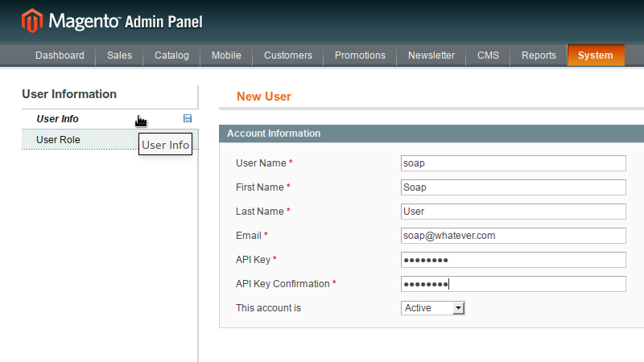
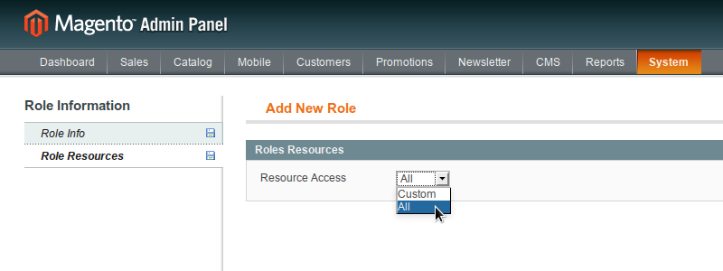
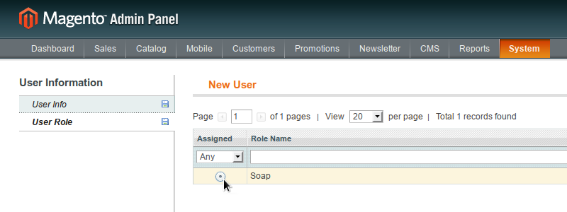
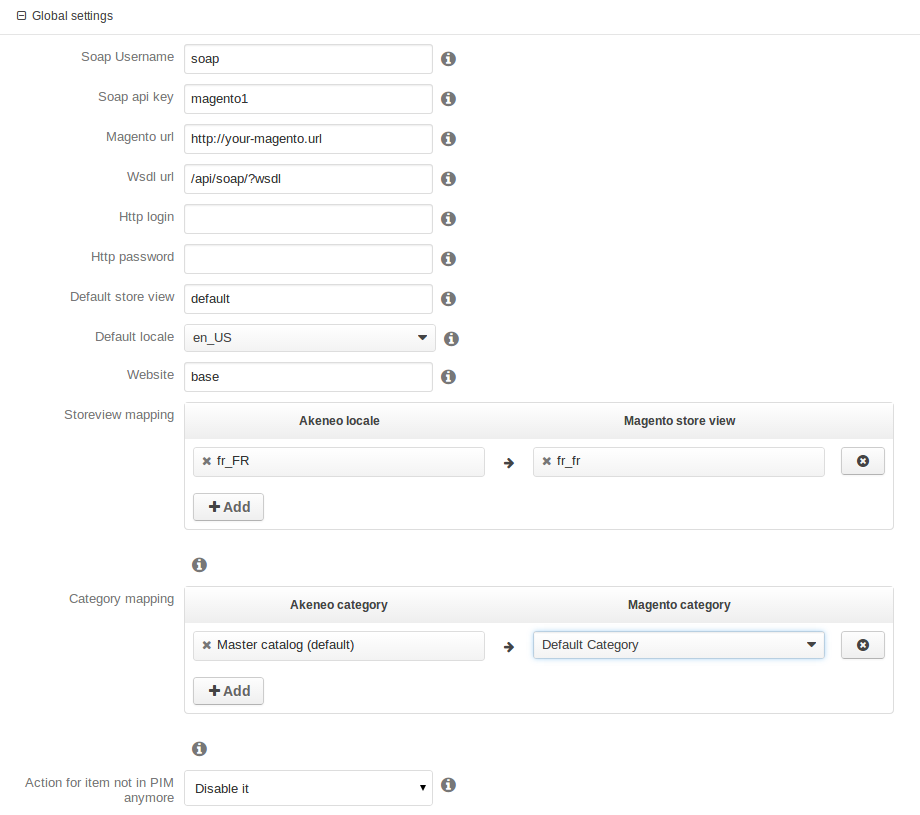

# MagentoConnectorBundle for Akeneo

Welcome on the Akeneo PIM Magento connector bundle.

This repository is issued to develop the Magento Connector for Akeneo PIM.

Warning: this connector is not production ready and is intended for evaluation and development purposes only!

# Requirements

 - php5-xml
 - php5-soap
 - Akeneo PIM 1.2.x stable

# Installation instructions

Please make sure that your version of PHP has support for SOAP and XML (natively coming with PHP for Debian based distributions).

## Installing the Magento Connector in an Akeneo PIM standard installation

If not already done, install Akeneo PIM (see [this documentation](https://github.com/akeneo/pim-community-standard)).

The PIM installation directory where you will find `app`, `web`, `src`, ... is called thereafter `/my/pim/installation/dir`.

Get composer:

    $ cd /my/pim/installation/dir
    $ curl -sS https://getcomposer.org/installer | php

Install the MagentoConnector with composer:

    $ php composer.phar require akeneo/connector-mapping-bundle": "v1.0.0-BETA3@dev"
    $ php composer.phar require akeneo/delta-export-bundle:v1.0.0-BETA3@dev
    $ php composer.phar require akeneo/magento-connector-bundle:1.1.*@stable

Enable bundles in the `app/AppKernel.php` file, in the `registerBundles` function just before the `return $bundles` line:

    $bundles[] = new Pim\Bundle\DeltaExportBundle\PimDeltaExportBundle();
    $bundles[] = new Pim\Bundle\ConnectorMappingBundle\PimConnectorMappingBundle();
    $bundles[] = new Pim\Bundle\MagentoConnectorBundle\PimMagentoConnectorBundle();

You can now update your database:

    php app/console doctrine:schema:update --force

Don't forget to reinstall pim assets:

    php app/console pim:installer:assets

If you want to manage configurable products, you'll need to add [magento-improve-api](https://github.com/jreinke/magento-improve-api) in your Magento installation.

## Installing the Magento Connector in an Akeneo PIM development environment

The following installation instructions are meant for development on the Magento Connector itself. Start by setting up a working installation as previously explained.

Then clone the Magento Connector bundle anywhere on your file system and create a symbolic link to your Akeneo installation's vendor folder (after renaiming/deleting the previous one).

Don't forget to reinstall pim assets (again):

    php app/console pim:installer:assets

# Configuration

In order to export products to Magento, a SOAP user with full rights has to be created on Magento.

For that, in the Magento Admin Panel, access `Web Services > SOAP/XML-RPC - Roles`, then click on `Add New Role` button. Create a role, choose a name, for instance “Soap”, and select `All` in Roles Resources.

*Role name setup example*:

*Role resources setup example*:

Now you can create a soap user. Go to `Web Services > SOAP/XML-RPC - Users` and click on “Add New User” button. Complete user info at your liking, then select “Soap” (or whatever name you gave to it) role in the User Role section.

*User setup example*:

*User role setup example*:

*Role resources setup example*:

Now you can create a soap user. Go to `Web Services > SOAP/XML-RPC - Users` and click on “Add New User” button. Complete user info at your liking, then select “Soap” (or whatever name you gave to it) role in the User Role section.

*User setup example*:

*User role setup example*:

After that you can go to `Spread > Export profiles` on Akeneo PIM and create your first Magento export job.

*Configuration example*:

# Demo fixtures

To test the connector with the minimum data requirements, you can load the demo fixtures. Change the `installer_data` line from the `app/config/parameters.yml` file to:

    installer_data: 'PimMagentoConnectorBundle:demo_magento'

# Notes

## Mandatory attributes

The following Magento's attributes are mandatory for Magento and need to be created or mapped in Akeneo:

- name
- price
- description
- short_description
- tax_class_id

# Bug and issues

This bundle is still under active development. Expect bugs and instabilities. Feel free to report them on this repository's [issue section](https://github.com/akeneo/MagentoConnectorBundle/issues).

# Troubleshooting

You can find solutions for some common problems in the [troubleshooting section](./Resources/doc/troubleshooting.md).
