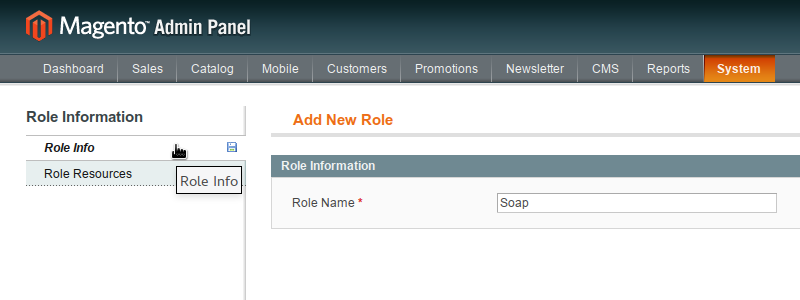
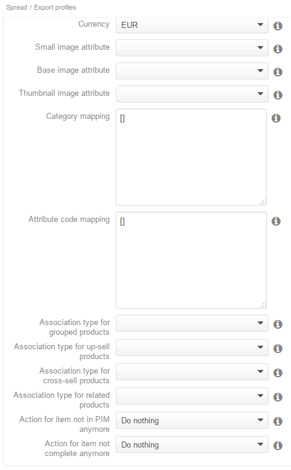

# MagentoConnectorBundle for Akeneo

Welcome on the Akeneo PIM Magento connector bundle.

This repository is issued to develop the Magento Connector for Akeneo PIM.

Warning: this connector is not production ready and is intended for evaluation and development purposes only!

# Requirements

 - php5-xml
 - php5-soap
 - Akeneo PIM 1.2.x stable

# Installation instructions

Please make sure that your version of PHP has support for SOAP and XML (natively coming with PHP for Debian based distributions).

## Installing the Magento Connector in an Akeneo PIM standard installation

If not already done, install Akeneo PIM (see [this documentation](https://github.com/akeneo/pim-community-standard)).

The PIM installation directory where you will find `app`, `web`, `src`, ... is called thereafter `/my/pim/installation/dir`.

Get composer:

    $ cd /my/pim/installation/dir
    $ curl -sS https://getcomposer.org/installer | php

Install the MagentoConnector with composer:

    $ php composer.phar require akeneo/magento-connector-bundle:1.1.*@stable

Enable bundles in the `app/AppKernel.php` file, in the `registerBundles` function just before the `return $bundles` line:

    $bundles[] = new Pim\Bundle\MagentoConnectorBundle\PimMagentoConnectorBundle();

You can now update your database:

    php app/console doctrine:schema:update --force

Don't forget to add guzzle in the composer.json of the pim

    "require": {
        "guzzle/service": ">=3.6.0,<3.8.0"
    },

and to reinstall pim assets

    php app/console pim:installer:assets

If you want to manage configurable products, you'll need to add [magento-improve-api](https://github.com/jreinke/magento-improve-api) in your Magento installation.

## Installation the Magento Connector in an Akeneo PIM development environment

The following installation instructions are meant for development on the Magento Connector itself.

To install the Magento connector for development purposes, the best way is to clone it anywhere on your file system and create a symbolic link to your Akeneo installation's src folder.

After that, add bundles to your `AppKernel.php`:

    $bundles[] = new Pim\Bundle\MagentoConnectorBundle\PimMagentoConnectorBundle();

Don't forget to add guzzle in the composer.json of the pim

    "require": {
        "guzzle/service": ">=3.6.0,<3.8.0"
    },

and to reinstall pim assets

    php app/console pim:installer:assets

# Configuration

In order to export products to Magento, a SOAP user with full rights has to be created on Magento.

For that, in the Magento Admin Panel, access `Web Services > SOAP/XML-RPC - Roles`, then click on `Add New Role` button. Create a role, choose a name, for instance “Soap”, and select `All` in Roles Resources.

*Role name setup example*:

*Role resources setup example*:

Now you can create a soap user. Go to `Web Services > SOAP/XML-RPC - Users` and click on “Add New User” button. Complete user info at your liking, then select “Soap” (or whatever name you gave to it) role in the User Role section.

*User setup example*:

*User role setup example*:

After that you can go to `Spread > Export profiles` on Akeneo PIM and create your first Magento export job.

*Configuration example*:

# Demo fixtures

To test the connector with the minimum data requirements, you can load the demo fixtures. Change the `installer_data` line from the `app/config/parameters.yml` file to:

    installer_data: 'PimMagentoConnectorBundle:demo_magento'

# Notes

## Mandatory attributes

The following Magento's attributes are mandatory for Magento and need to be created or mapped in Akeneo:

- name
- price
- description
- short_description
- tax_class_id

# Troubleshooting

If you encounter a problem with the “Storeview mapping” form, like in the screenshot below:

*Storeview mapping form problem*:

then you probably have forget to reinstall assets after installing the Magento connector. A simple

    php app/console pim:installer:assets
    
should settle the problem.

# Bug and issues

This bundle is still under active development. Expect bugs and instabilities. Feel free to report them on this repository's [issue section](https://github.com/akeneo/MagentoConnectorBundle/issues).

# Troubleshooting

## Cannot create image
This error is in fact pretty rarely linked to images themselves. When the Magento Connector Bundle sends the image after the product has been created or updated, Magento goes through the Product save event flow. On this event, the url_key is generated. If a product has already been created with the same name, the url_key cannot be generated and error is issued, triggering an "Cannot create image" error, and losing at the same time the real reason why the image was not created.

To debug, you can add a log in the Mage_Catalog_Model_Product_Attribute_Media_Api class, in the catch(Exception $e) (around line 186, to log what is the real Exception.

## Unable to find category
If you already sent the categories with the category export or the full export, but the Magento Connector Bundle still tells you that the category must be exported when you export products, there's a high chance that you spell the Magento URL and the WSDL URL differently between the export that sent categories and the product export. Sometimes, you've added a "/" at the end of the Magento URL parameter on one of the export and none on the other. It's enough so for the Magento Connector to believe it's a different Magento so the previously exported categories are not part of the same Magento.
